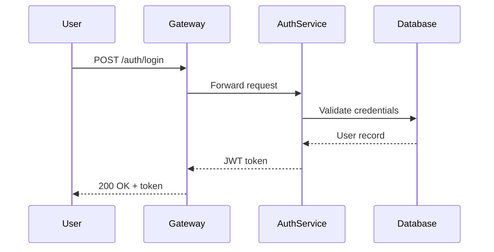
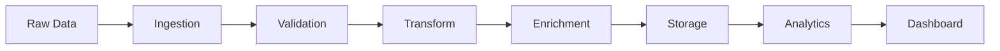
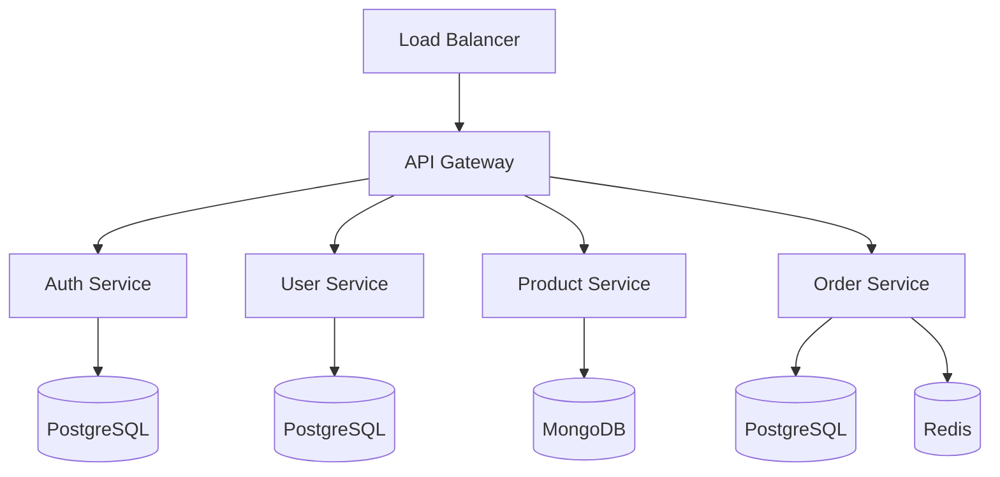

# Enterprise Architecture Document

## Executive Summary

This document outlines the complete architecture for our enterprise application platform. It covers the frontend, backend, data layer, and infrastructure components.

## System Overview

The platform consists of multiple microservices communicating through an event-driven architecture. Each service is independently deployable and scalable.

### Core Principles

- **Separation of Concerns**: Each service owns its domain
- **Event-Driven**: Asynchronous communication via message queues
- **Cloud-Native**: Designed for container orchestration
- **Observable**: Built-in logging, metrics, and tracing

## Frontend Architecture

### Technology Stack

| Technology | Purpose |
|-----------|---------|
| React 19 | UI Framework |
| TypeScript | Type Safety |
| Vite | Build Tool |
| Zustand | State Management |
| TailwindCSS | Styling |

### Component Hierarchy

The frontend follows an atomic design pattern:

1. **Atoms** - Basic UI elements (buttons, inputs, labels)
2. **Molecules** - Composed atoms (form fields, search bars)
3. **Organisms** - Complex sections (navigation, data tables)
4. **Templates** - Page layouts
5. **Pages** - Complete views with data

### State Management

```typescript
interface AppState {
  user: User | null;
  theme: 'light' | 'dark';
  notifications: Notification[];
}

const useStore = create<AppState>((set) => ({
  user: null,
  theme: 'light',
  notifications: [],
}));
```

## Backend Architecture

### Service Catalog

| Service | Port | Database | Description |
|---------|------|----------|-------------|
| auth-service | 3001 | PostgreSQL | Authentication & authorization |
| user-service | 3002 | PostgreSQL | User profile management |
| product-service | 3003 | MongoDB | Product catalog |
| order-service | 3004 | PostgreSQL | Order processing |
| notification-service | 3005 | Redis | Real-time notifications |
| analytics-service | 3006 | ClickHouse | Usage analytics |

### API Gateway

The API gateway handles:

- Request routing
- Rate limiting
- Authentication token validation
- Request/response transformation
- Circuit breaking

```yaml
routes:
  - path: /api/v1/auth/**
    service: auth-service
    rateLimit: 100/min
  - path: /api/v1/users/**
    service: user-service
    rateLimit: 500/min
  - path: /api/v1/products/**
    service: product-service
    rateLimit: 1000/min
```

### Authentication Flow



### Data Processing Pipeline



## Data Layer

### Database Schema Design

Each service owns its database. No shared databases between services.

#### User Service Schema

```sql
CREATE TABLE users (
    id UUID PRIMARY KEY DEFAULT gen_random_uuid(),
    email VARCHAR(255) UNIQUE NOT NULL,
    password_hash VARCHAR(255) NOT NULL,
    full_name VARCHAR(255) NOT NULL,
    role VARCHAR(50) DEFAULT 'user',
    created_at TIMESTAMPTZ DEFAULT NOW(),
    updated_at TIMESTAMPTZ DEFAULT NOW()
);

CREATE TABLE user_preferences (
    user_id UUID REFERENCES users(id) ON DELETE CASCADE,
    key VARCHAR(100) NOT NULL,
    value JSONB NOT NULL,
    PRIMARY KEY (user_id, key)
);
```

### Caching Strategy

- **L1 Cache**: In-memory (application level) - 5 minute TTL
- **L2 Cache**: Redis cluster - 30 minute TTL
- **L3 Cache**: CDN edge - 24 hour TTL for static assets

## Infrastructure

### Deployment Architecture



### Monitoring Stack

| Tool | Purpose |
|------|---------|
| Prometheus | Metrics collection |
| Grafana | Visualization |
| Loki | Log aggregation |
| Jaeger | Distributed tracing |
| PagerDuty | Alerting |

### SLA Targets

- **Availability**: 99.95% uptime
- **Latency**: p99 < 200ms for API calls
- **Recovery**: RTO < 15 minutes, RPO < 5 minutes
- **Throughput**: 10,000 requests/second sustained

## Security

### Security Layers

1. **Network**: VPC isolation, security groups, WAF
2. **Transport**: TLS 1.3 everywhere
3. **Application**: JWT auth, RBAC, input validation
4. **Data**: Encryption at rest (AES-256), PII masking
5. **Audit**: Complete audit trail, SOC2 compliance

### RBAC Matrix

| Role | Read Users | Write Users | Read Products | Admin |
|------|-----------|-------------|---------------|-------|
| viewer | Yes | No | Yes | No |
| editor | Yes | Yes | Yes | No |
| admin | Yes | Yes | Yes | Yes |

## Appendix

### Glossary

- **JWT**: JSON Web Token
- **RBAC**: Role-Based Access Control
- **RTO**: Recovery Time Objective
- **RPO**: Recovery Point Objective
- **WAF**: Web Application Firewall
- **VPC**: Virtual Private Cloud

### Change Log

| Version | Date | Author | Changes |
|---------|------|--------|---------|
| 1.0 | 2026-01-15 | Engineering | Initial draft |
| 1.1 | 2026-02-01 | Engineering | Added security section |
| 1.2 | 2026-03-15 | Architecture | Updated deployment diagrams |
